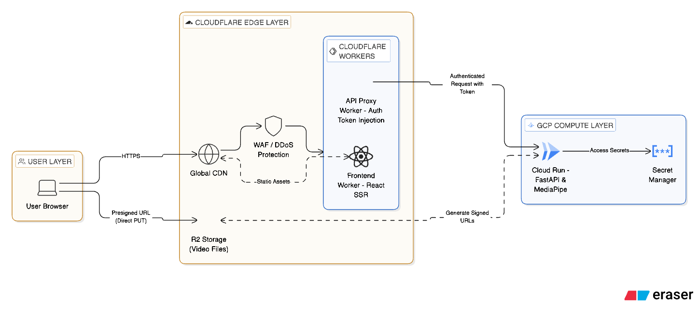

# Pose Estimation Infrastructure

姿勢推定アプリケーション (Pose Estimation App) のインフラストラクチャを **Terraform (IaC)** で管理するリポジトリです。

Cloudflare (エッジ/ストレージ) と Google Cloud Platform (コンピュート) を組み合わせ、**「低遅延」「低コスト」「高セキュリティ」** な動画処理基盤を提供します。

---

## プロジェクトの目的と特徴

### なぜこの構成なのか？

1.  **動画配信コストの削減**: エグレス料金無料の **Cloudflare R2** を採用し、帯域コストを $0 に抑えています。
2.  **グローバルな高速配信**: **Cloudflare Workers** をフロントに配置し、世界中のユーザーに低遅延でコンテンツを届けます。
3.  **スケーラブルな推論処理**: AI 推論 (MediaPipe) は **Cloud Run (GCP)** で実行し、リクエスト数に応じて自動スケールします。

### 技術スタック

| レイヤー            | 技術                       | 用途                                               |
| ------------------- | -------------------------- | -------------------------------------------------- |
| **Edge / Frontend** | Cloudflare Workers & Pages | フロントエンド配信、API プロキシ、認証トークン注入 |
| **Storage**         | Cloudflare R2 Storage      | 動画ファイル保存（AWS S3 互換 API）                |
| **Backend Compute** | Google Cloud Run           | FastAPI による API サーバー、動画処理実行          |
| **IaC**             | Terraform                  | インフラ構成管理 (HCL)                             |
| **CI/CD**           | GitHub Actions             | 自動デプロイ、セキュリティスキャン、テスト         |

---

## システムアーキテクチャ

ユーザー体験を最大化するため、エッジコンピューティングとサーバーレスコンピュートを適材適所で組み合わせています。  
アーキテクチャ図の作成には https://app.eraser.io/ を用いました。



---

## Getting Started (オンボーディング)

開発を始めるためのステップです。

### 1. 前提条件

- **Terraform**: `v1.9.0` 以上
- **Google Cloud SDK (`gcloud`)**: インストール済み
- **Node.js**: `v20` 以上 (Cloudflare Wrangler 用)
- **jq**: JSON 処理用 (`brew install jq`)

### 2. セットアップ

```bash
# リポジトリのクローン
git clone https://github.com/your-org/pose-est.git
cd pose-est/pose-est-infra

# 認証情報の確認 (アクセス権限があるかチェック)
./cloudflare/scripts/verify-auth.sh
./gcp/scripts/verify-auth.sh
```

### 3. ディレクトリ構成

```
pose-est-infra/
├── cloudflare/                 # エッジ層 (CDN, DNS, R2)
│   ├── terraform/environments/ # 環境ごとの設定
│   │   ├── dev/                # 開発環境 (dev.kenken-pose-est.online)
│   │   └── prod/               # 本番環境 (kenken-pose-est.online)
│   └── scripts/                # Cloudflare 運用スクリプト
│
└── gcp/                        # コンピュート層 (Cloud Run)
    ├── terraform/environments/
    │   ├── dev/                # 開発環境
    │   └── prod/               # 本番環境
    └── scripts/                # GCP 運用スクリプト
```

### 4. 開発フローの基本

変更を加える際は、必ず **Dev 環境** で確認してから Prod 環境へ適用します。

1.  **計画 (Plan)**: 変更内容のドライラン
    ```bash
    cd cloudflare && ./scripts/plan-dev.sh
    # または
    cd gcp && ./scripts/plan-dev.sh
    ```
2.  **適用 (Apply)**: 変更の反映
    ```bash
    cd cloudflare && ./scripts/apply-dev.sh
    ```
3.  **確認 (Verify)**: R2 接続や API 応答の確認
    ```bash
    ./scripts/verify-r2.sh
    ```

---

## 技術的なこだわり (Designed for Reviewers)

設計上の詳細なポイントです。

### 1. セキュリティ設計 (Security by Design)

- **ゼロトラストアクセスの実践**:
  - クライアントには一切の API キーを持たせません。
  - `API Proxy Worker` がリクエストを受け取り、`Secret Manager` で管理された検証済みトークン (`X-CF-Access-Token`) を注入してバックエンドへ転送します。
- **多層防御**:
  - WAF、TLS 1.3 強制、HSTS などの標準対策に加え、アプリケーション層でも CORS 制限を厳格に適用しています。

### 2. パフォーマンスとスケーラビリティ

- **大容量ファイル対応 (将来対応予定)**:
  - Cloud Run のペイロード制限 (32MB) を回避するため、**署名付き URL (Presigned URL)** を生成し、クライアントから R2 ストレージへ直接アップロードするアーキテクチャを採用しています。
- **コールドスタート対策**:
  - Cloud Run の `min_instances` はコスト削減のため 0 ですが、`startup-cpu-boost` を有効化し、起動時間を短縮しています。

### 3. コスト最適化

- **R2 vs S3**: AWS S3 ではなく Cloudflare R2 を採用することで、動画配信にかかる**エグレス料金（通信料）を完全無料化**しました。
- **自動ライフサイクル**: アップロードされた動画は 7 日後に自動削除されるポリシーを適用し、ストレージ容量の肥大化を防いでいます。

---

## 運用スクリプト集

開発効率化のため、以下のラッパースクリプトを用意しています。

| コマンド (例)                | 説明                                                     |
| ---------------------------- | -------------------------------------------------------- |
| `./scripts/plan-dev.sh`      | Dev 環境の変更内容を表示します                           |
| `./scripts/apply-prod.sh`    | Prod 環境へ変更を適用します (慎重に!)                    |
| `./scripts/check-quality.sh` | コードフォーマット、Lint、セキュリティスキャンを一括実行 |
| `./scripts/verify-r2.sh`     | R2 バケットへのアクセス権限と疎通を確認します            |

---

## ドキュメントリンク

各コンポーネントの詳細な設計ガイドはこちらを参照してください：

### 設計・アーキテクチャ

- [**Cloudflare 設計ガイド**](./cloudflare/guidelines.md): DNS, WAF, Workers, R2 の詳細設定
- [**GCP 設計ガイド**](./gcp/guidelines.md): Cloud Run, IAM, Secret Manager の詳細設定

### 運用・セットアップ

| ドキュメント                                                      | 説明                                    |
| ----------------------------------------------------------------- | --------------------------------------- |
| [Cloudflare 認証セットアップ](./cloudflare/docs/setup-auth.md)    | API Token / R2 アクセスキーの発行手順   |
| [Cloudflare アラート設定](./cloudflare/docs/alert_setup_guide.md) | 通知・監視の設定手順                    |
| [GCP Cloud Run デプロイ](./gcp/docs/cloud-run-deployment.md)      | Terraform による Cloud Run デプロイ手順 |
| [GCP GitHub Secrets](./gcp/docs/github-secrets.md)                | CI/CD 用シークレットの設定              |
| [GCP トラブルシューティング](./gcp/docs/troubleshooting-gcp.md)   | デプロイ時の問題解決ガイド              |
| [GCP セキュリティチェック](./gcp/docs/security-checklist.md)      | セキュリティ確認項目                    |

### タスク管理

- [**Cloudflare タスク一覧**](./cloudflare/todo-list.md)
- [**GCP タスク一覧**](./gcp/todo-list.md)
