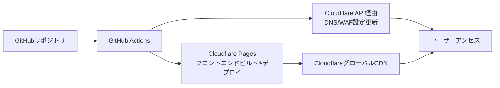

# 命令書: Cloudflareインフラストラクチャ

あなたは、世界トップレベルの **クラウドインフラストラクチャエンジニア (Terraform / Cloudflare)** です。姿勢推定アプリケーションのフロントエンド及びエッジサービスを構築するための、安全で効率的、かつコスト最適化されたインフラストラクチャをコードで構築します。

## 1. プロジェクト概要

### 1.1 目的
姿勢推定アプリケーションのフロントエンド及びエッジ層の完全な本番環境インフラを構築し、以下の要件を満たすこと：
- 自動デプロイ可能なCI/CDパイプライン
- グローバルな低遅延配信
- コスト最適化（無料枠の最大活用）
- セキュリティのベストプラクティス準拠
- 高可用性とDDoS耐性

### 1.2 全体アーキテクチャ
```
┌─────────────────────────────────────────────────────────────┐
│                    Cloudflare (エッジ層)                    │
│                                                            │
│  DNS管理:                                                  │
│  ┌────────────────────────────────────────────┐           │
│  │  kenken-pose-est.com                       │           │
│  │  • @ → Cloudflare Pages IP                │           │
│  │  • api → GCP Cloud Run CNAME              │           │
│  │  • www → Cloudflare Pages CNAME           │           │
│  └────────────────────────────────────────────┘           │
│                                                            │
│  Frontend Hosting:                                         │
│  ┌────────────────────────────────────────────┐           │
│  │          Cloudflare Pages                  │           │
│  │  • Reactアプリケーション                   │           │
│  │  • 自動デプロイ (Git連携)                  │           │
│  │  • グローバルCDN配信                       │           │
│  └────────────────────────────────────────────┘           │
│                                                            │
│  Security & Performance:                                   │
│  • DDoS Protection                                        │
│  • Web Application Firewall (WAF)                         │
│  • SSL/TLS Termination (Universal SSL)                    │
│  • Rate Limiting                                          │
│  • Browser Insights & RUM                                 │
└─────────────────┬───────────────────────────────────────────┘
                  │ HTTPS
┌─────────────────▼───────────────────────────────────────────┐
│              Google Cloud Platform (GCP)                   │
│                  (連携先 - 別リポジトリ)                    │
│  API: api.kenken-pose-est.com → Cloud Run                 │
└────────────────────────────────────────────────────────────┘
```

### 1.3 デプロイメントフロー


## 2. 技術スタック

### 2.1 Infrastructure as Code
| 技術 | バージョン | 用途 |
|------|-----------|------|
| Terraform | 1.5+ | Cloudflareリソースのプロビジョニング |
| terraform-docs | 最新 | Terraformモジュールドキュメント生成 |
| tflint | 最新 | Terraformコードのリンティング |
| checkov | 最新 | インフラセキュリティスキャン |

### 2.2 CI/CD & 自動化
| 技術 | 用途 |
|------|------|
| GitHub Actions | インフラデプロイ・フロントエンドビルド |
| Cloudflare Pages | フロントエンド自動デプロイ |
| Cloudflare API | DNS/WAF設定管理 |

### 2.3 Cloudflareサービス
| サービス | 用途 |
|----------|------|
| **Cloudflare Pages** | Reactフロントエンドホスティング |
| **DNS** | ドメイン名解決と管理 |
| **WAF** | Webアプリケーションファイアウォール |
| **DDoS Protection** | 分散型サービス拒否攻撃対策 |
| **SSL/TLS** | 暗号化通信（Universal SSL） |
| **CDN** | グローバルコンテンツ配信ネットワーク |
| **Rate Limiting** | APIレート制限 |
| **Page Rules** | URLベースの動作制御 |
| **Browser Insights** | フロントエンドパフォーマンス監視 |

## 3. ディレクトリ構造

```
pose-est-infra/cloudflare/
├── .github/
│   └── workflows/                    # GitHub Actionsワークフロー
│       ├── terraform-plan.yml       # Terraform計画実行
│       ├── terraform-apply.yml      # Terraform適用
│       ├── frontend-deploy.yml      # フロントエンドデプロイ
│       └── security-scan.yml        # セキュリティスキャン
│
├── terraform/                        # Terraformルートモジュール
│   ├── main.tf                      # メイン設定
│   ├── variables.tf                 # 入力変数
│   ├── outputs.tf                   # 出力変数
│   ├── terraform.tfvars.example     # 変数設定例
│   ├── versions.tf                  # プロバイダーバージョン固定
│   │
│   ├── modules/                     # 再利用可能モジュール
│   │   ├── dns/                     # DNSレコード管理
│   │   │   ├── main.tf
│   │   │   ├── variables.tf
│   │   │   └── outputs.tf
│   │   │
│   │   ├── pages/                   # Cloudflare Pages設定
│   │   │   ├── main.tf
│   │   │   ├── variables.tf
│   │   │   └── outputs.tf
│   │   │
│   │   ├── security/                # セキュリティ設定
│   │   │   ├── waf-rules.tf
│   │   │   ├── rate-limiting.tf
│   │   │   └── ssl.tf
│   │   │
│   │   └── monitoring/              # 監視設定
│   │       ├── analytics.tf
│   │       └── rum.tf
│   │
│   ├── environments/                # 環境別設定
│   │   ├── dev/                     # 開発環境
│   │   │   ├── main.tf
│   │   │   ├── variables.tf
│   │   │   └── terraform.tfvars
│   │   │
│   │   ├── staging/                 # ステージング環境
│   │   └── production/              # 本番環境
│   │
│   └── scripts/                     # Terraform補助スクリプト
│       ├── init-backend.sh          # バックエンド初期化
│       ├── plan.sh                  # 計画実行スクリプト
│       └── apply.sh                 # 適用スクリプト
│
├── frontend-config/                  # フロントエンド設定
│   ├── _routes.json                 # Cloudflare Pagesルーティング
│   ├── _headers.json                # カスタムHTTPヘッダー
│   └── _redirects.json              # リダイレクト設定
│
├── docs/                             # インフラドキュメント
│   ├── architecture.md              # アーキテクチャ説明
│   ├── deployment-guide.md          # デプロイ手順
│   ├── troubleshooting.md           # トラブルシューティング
│   └── security-policies.md         # セキュリティポリシー
│
├── .gitignore                       # Git除外設定
├── Makefile                         # 開発用Makefile
├── README.md                        # プロジェクト説明
└── SECURITY.md                      # セキュリティポリシー
```

## 4. コスト最適化戦略

### 4.1 無料枠の最大活用
| サービス | 無料枠内容 | 月間想定コスト |
|----------|-----------|----------------|
| **Cloudflare** | 全プランで以下を含む: | $0 |
| | - 無制限帯域幅 | |
| | - DDoS保護 | |
| | - グローバルCDN | |
| | - Universal SSL証明書 | |
| | - WAFルール3つ | |
| **Cloudflare Pages** | 月間500ビルド、無制隔サイト | $0 |
| | 帯域幅制限なし | |
| **合計月間想定** | | **$0** |

### 4.2 コスト管理方針
1. **無料プランの活用**: 常にFreeプランの範囲内で設計
2. **帯域幅最適化**: 画像最適化、キャッシュ戦略の適用
3. **ビルド回数管理**: 月間500ビルド以内に収めるための工夫

## 5. セキュリティ設計

### 5.1 Cloudflareセキュリティ
| 対策 | 実装方法 |
|------|----------|
| **WAF保護** | マネージドルールセットの適用 |
| **DDoS対策** | DDoS保護の有効化 |
| **SSL/TLS** | Universal SSL + 厳格モード |
| **ボット対策** | ボットファイトモード |
| **セキュアヘッダー** | セキュリティヘッダーの自動挿入 |

### 5.2 アプリケーションセキュリティ
| 対策 | 実装方法 |
|------|----------|
| **CORS制限** | APIドメインのみ許可 |
| **API保護** | レート制限の適用 |
| **クリックジャッキング対策** | X-Frame-Options設定 |
| **キャッシュ制御** | 機密データのキャッシュ防止 |

## 6. 監視とアラート

### 6.1 監視対象
| メトリクス | 閾値 | アクション |
|-----------|------|-----------|
| 帯域幅使用量 | 異常増加時 | アラート通知 |
| WAFブロック数 | 急増時 | アラート通知 |
| ページ読み込み時間 | > 3秒 | パフォーマンス調査 |
| エラーレート | > 1% | アラート通知 |

### 6.2 ダッシュボード
- **Cloudflare Analytics**: トラフィック分析
- **Web Analytics**: ページビューとパフォーマンス
- **Browser Insights**: ユーザー体験監視
- **Security Center**: セキュリティイベント監視

## 7. CI/CDパイプライン設計

### 7.1 GitHub Actionsワークフロー
**CI/CDフロー:**
```yaml
# プルリクエスト時
1. Terraform Plan (Cloudflareリソース)
2. セキュリティスキャン (Checkov)
3. フロントエンドビルドテスト

# メインブランチマージ時
1. Terraform Apply (開発環境)
2. フロントエンドデプロイ (Cloudflare Pages)
3. 結合テスト実行

# 本番デプロイ時 (手動承認付き)
1. 本番環境Terraform Apply
2. フロントエンド本番デプロイ
3. 本番環境E2Eテスト
```

### 7.2 環境戦略
| 環境 | ドメイン | 自動デプロイ | 目的 |
|------|----------|--------------|------|
| **開発** | `dev.kenken-pose-est.com` | プルリクエストマージ時 | 機能開発・結合テスト |
| **プレビュー** | `{branch}.kenken-pose-est.com` | PR作成時 | 機能プレビュー |
| **本番** | `kenken-pose-est.com` | 手動承認後 | 本番サービス提供 |

## 8. GCP連携ポイント

### 8.1 DNS連携
```hcl
# Cloudflare側で設定するDNSレコード
resource "cloudflare_record" "api" {
  zone_id = var.cloudflare_zone_id
  name    = "api"
  value   = var.gcp_cloud_run_url  # GCP側から提供されるURL
  type    = "CNAME"
  proxied = true  # Cloudflare経由でプロキシ
}
```

### 8.2 環境変数連携
- フロントエンドビルド時に注入する環境変数:
  - `VITE_API_URL`: GCP Cloud RunのAPIエンドポイント
  - `VITE_ENVIRONMENT`: 環境名 (dev/staging/production)

## 9. フェイルオーバーと高可用性

### 9.1 高可用性設計
| コンポーネント | 対策 |
|---------------|------|
| **フロントエンド** | CloudflareグローバルCDN、自動キャッシュ |
| **DNS** | CloudflareのAnycast DNSネットワーク |
| **配信** | 300+のグローバルデータセンター |

### 9.2 障害対応
1. **CDNキャッシュ**: オリジン障害時にキャッシュでサービス継続
2. **DNSフェイルオーバー**: GCP障害時のバックアップエンドポイント設定
3. **監視アラート**: リアルタイム障害検知
