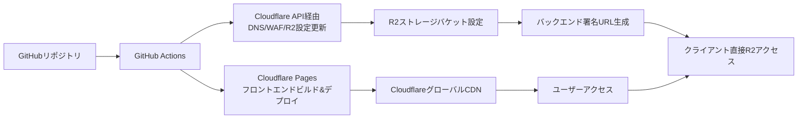

# 命令書: Cloudflare インフラストラクチャ

あなたは、世界トップレベルの **クラウドインフラストラクチャエンジニア (Terraform / Cloudflare)** です。姿勢推定アプリケーションのフロントエンド、エッジサービス、**およびストレージ層**を構築するための、安全で効率的、かつコスト最適化されたインフラストラクチャをコードで構築します。

## 1. プロジェクト概要

### 1.1 目的

姿勢推定アプリケーションのフロントエンド、エッジ層、**およびストレージ層**の完全な本番環境インフラを構築し、以下の要件を満たすこと：

- 自動デプロイ可能な CI/CD パイプライン
- グローバルな低遅延配信
- **エグレス料金なしのコスト最適化ストレージ**
- セキュリティのベストプラクティス準拠
- 高可用性と DDoS 耐性

### 1.2 全体アーキテクチャ (R2 統合版)

```
┌─────────────────────────────────────────────────────────────────────┐
│                    Cloudflare (エッジ & ストレージ層)              │
│                                                                    │
│  DNS管理:                                                          │
│  ┌────────────────────────────────────────────┐                   │
│  │  kenken-pose-est.online                       │                   │
│  │  • @ → Cloudflare Pages IP                │                   │
│  │  • api → GCP Cloud Run CNAME              │                   │
│  │  • www → Cloudflare Pages CNAME           │                   │
│  └────────────────────────────────────────────┘                   │
│                                                                    │
│  Frontend Hosting:                                                 │
│  ┌────────────────────────────────────────────┐                   │
│  │          Cloudflare Pages                  │                   │
│  │  • Reactアプリケーション                   │                   │
│  │  • 自動デプロイ (Git連携)                  │                   │
│  │  • グローバルCDN配信                       │                   │
│  └────────────────────────────────────────────┘                   │
│                                                                    │
│  Storage Layer:                                                    │
│  ┌────────────────────────────────────────────┐                   │
│  │          Cloudflare R2                     │                   │
│  │  • 処理済み動画ファイル保存                │                   │
│  │  • ライフサイクル管理 (7日自動削除)       │                   │
│  │  • S3互換APIによるアクセス                │                   │
│  │  • エグレス料金ゼロ                       │                   │
│  └────────────────────────────────────────────┘                   │
│                                                                    │
│  Security & Performance:                                           │
│  • DDoS Protection                                                │
│  • Web Application Firewall (WAF)                                 │
│  • SSL/TLS Termination (Universal SSL)                            │
│  • Rate Limiting                                                  │
│  • Browser Insights & RUM                                         │
└─────────────────┬───────────────────────────────────────────────┘
                  │ HTTPS (API & 署名URL経由のストレージアクセス)
┌─────────────────▼───────────────────────────────────────────────┐
│              Google Cloud Platform (GCP)                       │
│                  (連携先 - 別リポジトリ)                        │
│  API: api.kenken-pose-est.online → Cloud Run                     │
│  R2連携: 署名URL生成 → 直接R2アクセス                         │
└────────────────────────────────────────────────────────────────┘
```

### 1.3 デプロイメントフロー (R2 統合版)



## 2. 技術スタック

### 2.1 Infrastructure as Code

| 技術           | バージョン | 用途                                  |
| -------------- | ---------- | ------------------------------------- |
| Terraform      | 1.14+      | Cloudflare リソースのプロビジョニング |
| terraform-docs | 最新       | Terraform モジュールドキュメント生成  |
| tflint         | 最新       | Terraform コードのリンティング        |
| checkov        | 最新       | インフラセキュリティスキャン          |
| **AWS S3 SDK** | **最新**   | **R2 S3 互換 API 用**                 |

### 2.2 CI/CD & 自動化

| 技術             | 用途                                   |
| ---------------- | -------------------------------------- |
| GitHub Actions   | インフラデプロイ・フロントエンドビルド |
| Cloudflare Pages | フロントエンド自動デプロイ             |
| Cloudflare API   | DNS/WAF/R2 設定管理                    |
| **R2 S3 API**    | **ストレージ操作・署名 URL 生成**      |

### 2.3 Cloudflare サービス

| サービス             | 用途                                 |
| -------------------- | ------------------------------------ |
| **Cloudflare Pages** | React フロントエンドホスティング     |
| **Cloudflare R2**    | **処理済み動画ファイルストレージ**   |
| **DNS**              | ドメイン名解決と管理                 |
| **WAF**              | Web アプリケーションファイアウォール |
| **DDoS Protection**  | 分散型サービス拒否攻撃対策           |
| **SSL/TLS**          | 暗号化通信（Universal SSL）          |
| **CDN**              | グローバルコンテンツ配信ネットワーク |
| **Rate Limiting**    | API レート制限                       |
| **Page Rules**       | URL ベースの動作制御                 |
| **Browser Insights** | フロントエンドパフォーマンス監視     |

## 3. ディレクトリ構造

以下はあくまで例で、TODO リストのフェーズ/タスクごとにフォルダやファイル構成など逐一見直していく

```
pose-est-infra/cloudflare/
├── .github/
│   └── workflows/                    # GitHub Actionsワークフロー
│       ├── terraform-plan.yml       # Terraform計画実行
│       ├── terraform-apply.yml      # Terraform適用
│       ├── frontend-deploy.yml      # フロントエンドデプロイ
│       └── security-scan.yml        # セキュリティスキャン
│
├── terraform/                        # Terraformルートモジュール
│   ├── main.tf                      # メイン設定
│   ├── variables.tf                 # 入力変数
│   ├── outputs.tf                   # 出力変数
│   ├── terraform.tfvars.example     # 変数設定例
│   ├── versions.tf                  # プロバイダーバージョン固定
│   │
│   ├── modules/                     # 再利用可能モジュール
│   │   ├── dns/                     # DNSレコード管理
│   │   ├── pages/                   # Cloudflare Pages設定
│   │   ├── r2/                      # R2ストレージ設定
│   │   ├── security/                # セキュリティ設定
│   │   └── monitoring/              # 監視設定
│   │
│   ├── environments/                # 環境別設定
│   │   ├── dev/                     # 開発環境
│   │   │   ├── main.tf
│   │   │   ├── variables.tf
│   │   │   └── terraform.tfvars
│   │   │
│   │   └── production/              # 本番環境
│   │
│   └── scripts/                     # Terraform補助スクリプト
│       ├── init-backend.sh          # バックエンド初期化
│       ├── plan.sh                  # 計画実行スクリプト
│       ├── apply.sh                 # 適用スクリプト
│       └── r2-test.sh               # [新規] R2接続テストスクリプト
│
├── frontend-config/                  # フロントエンド設定
│
├── docs/                             # インフラドキュメント
│   ├── architecture.md              # アーキテクチャ説明
│   ├── deployment-guide.md          # デプロイ手順
│   ├── troubleshooting.md           # トラブルシューティング
│   ├── security-policies.md         # セキュリティポリシー
│   └── r2-integration-guide.md      # [新規] R2統合ガイド
│
├── .gitignore                       # Git除外設定
├── Makefile                         # 開発用Makefile
├── README.md                        # プロジェクト説明
└── SECURITY.md                      # セキュリティポリシー
```

## 4. コスト最適化戦略

### 4.1 無料枠の最大活用

| サービス             | 無料枠内容                                        | 月間想定コスト |
| -------------------- | ------------------------------------------------- | -------------- |
| **Cloudflare**       | 全プランで以下を含む:                             | $0             |
|                      | - 無制限帯域幅                                    |                |
|                      | - DDoS 保護                                       |                |
|                      | - グローバル CDN                                  |                |
|                      | - Universal SSL 証明書                            |                |
|                      | - WAF ルール 3 つ                                 |                |
| **Cloudflare Pages** | 月間 500 ビルド、無制限サイト                     | $0             |
|                      | 帯域幅制限なし                                    |                |
| **Cloudflare R2**    | **月間 10GB ストレージ、100 万回の A クラス操作** | **$0**         |
|                      | **エグレス料金なし**                              |                |
| **合計月間想定**     |                                                   | **$0**         |

### 4.2 コスト管理方針

1. **無料プランの活用**: 常に Free プランの範囲内で設計
2. **ストレージライフサイクル**: 7 日自動削除でストレージ使用量を最小化
3. **帯域幅最適化**: 画像最適化、キャッシュ戦略の適用
4. **ビルド回数管理**: 月間 500 ビルド以内に収めるための工夫
5. **R2 操作最適化**: A クラス操作（Put, Copy, Post, List）を最小化

## 5. セキュリティ設計

### 5.1 Cloudflare セキュリティ

| 対策                    | 実装方法                          |
| ----------------------- | --------------------------------- |
| **WAF 保護**            | マネージドルールセットの適用      |
| **DDoS 対策**           | DDoS 保護の有効化                 |
| **SSL/TLS**             | Universal SSL + 厳格モード        |
| **ボット対策**          | ボットファイトモード              |
| **セキュアヘッダー**    | セキュリティヘッダーの自動挿入    |
| **R2 アクセス制御**     | **署名 URL による一時的アクセス** |
| **R2 バケットポリシー** | **公開アクセス制限、CORS 設定**   |

### 5.2 アプリケーションセキュリティ

| 対策                         | 実装方法                                    |
| ---------------------------- | ------------------------------------------- |
| **CORS 制限**                | API ドメインのみ許可                        |
| **API 保護**                 | レート制限の適用                            |
| **クリックジャッキング対策** | X-Frame-Options 設定                        |
| **キャッシュ制御**           | 機密データのキャッシュ防止                  |
| **R2 署名 URL**              | **有効期限付き、IP 制限可能な一時アクセス** |
| **R2 オブジェクトロック**    | **必要に応じた不変性確保**                  |

## 6. 監視とアラート

### 6.1 監視対象

| メトリクス              | 閾値                     | アクション               |
| ----------------------- | ------------------------ | ------------------------ |
| 帯域幅使用量            | 異常増加時               | アラート通知             |
| WAF ブロック数          | 急増時                   | アラート通知             |
| ページ読み込み時間      | > 3 秒                   | パフォーマンス調査       |
| エラーレート            | > 1%                     | アラート通知             |
| **R2 ストレージ使用量** | **> 8GB (無料枠の 80%)** | **ストレージ最適化検討** |
| **R2 操作回数**         | **> 80 万回/月**         | **操作最適化検討**       |

### 6.2 ダッシュボード

- **Cloudflare Analytics**: トラフィック分析
- **Web Analytics**: ページビューとパフォーマンス
- **Browser Insights**: ユーザー体験監視
- **Security Center**: セキュリティイベント監視
- **R2 Analytics**: **ストレージ使用量、操作回数監視**

## 7. CI/CD パイプライン設計

### 7.1 GitHub Actions ワークフロー

**CI/CD フロー:**

```yaml
# プルリクエスト時
1. Terraform Plan (Cloudflareリソース含むR2)
2. セキュリティスキャン (Checkov)
3. フロントエンドビルドテスト
4. R2接続テスト (モックテスト)

# メインブランチマージ時
1. Terraform Apply (開発環境、R2バケット含む)
2. フロントエンドデプロイ (Cloudflare Pages)
3. R2バケット初期化テスト
4. 結合テスト実行

# 本番デプロイ時 (手動承認付き)
1. 本番環境Terraform Apply (R2ライフサイクルポリシー含む)
2. フロントエンド本番デプロイ
3. R2署名URL生成テスト
4. 本番環境E2Eテスト
```

### 7.2 環境戦略

| 環境           | ドメイン                          | R2 バケット            | 自動デプロイ           | 目的                 |
| -------------- | --------------------------------- | ---------------------- | ---------------------- | -------------------- |
| **開発**       | `dev.kenken-pose-est.online`      | `pose-est-videos-dev`  | プルリクエストマージ時 | 機能開発・結合テスト |
| **プレビュー** | `{branch}.kenken-pose-est.online` | 使用しない             | PR 作成時              | 機能プレビュー       |
| **本番**       | `kenken-pose-est.online`          | `pose-est-videos-prod` | 手動承認後             | 本番サービス提供     |

## 8. GCP 連携ポイント (R2 署名 URL 生成追加)

### 8.1 DNS 連携

```hcl
# Cloudflare側で設定するDNSレコード
resource "cloudflare_record" "api" {
  zone_id = var.cloudflare_zone_id
  name    = "api"
  value   = var.gcp_cloud_run_url  # GCP側から提供されるURL
  type    = "CNAME"
  proxied = true  # Cloudflare経由でプロキシ
}
```

### 8.2 R2 連携設定

```hcl
# Cloudflare側のR2バケット設定
resource "cloudflare_r2_bucket" "video_storage" {
  account_id = var.cloudflare_account_id
  name       = "pose-est-videos-${var.environment}"
  location   = "apac"  # アジア太平洋リージョン
}

# R2バケットのライフサイクル設定 (7日自動削除)
resource "cloudflare_r2_bucket_lifecycle_rule" "video_retention" {
  account_id = var.cloudflare_account_id
  bucket_name = cloudflare_r2_bucket.video_storage.name

  rule {
    id     = "7-day-retention"
    status = "enabled"

    expiration {
      days = 7  # 7日後に自動削除
    }
  }
}
```

### 8.3 環境変数連携

- フロントエンドビルド時に注入する環境変数:
  - `VITE_API_URL`: GCP Cloud Run の API エンドポイント
  - `VITE_ENVIRONMENT`: 環境名 (dev/production)
- **バックエンド設定用シークレット (Secret Manager 経由):**
  - `R2_ACCESS_KEY_ID`: R2 アクセスキー
  - `R2_SECRET_ACCESS_KEY`: R2 シークレットキー
  - `R2_ENDPOINT_URL`: `https://${account_id}.r2.cloudflarestorage.com`
  - `R2_BUCKET_NAME`: 環境別バケット名

## 9. フェイルオーバーと高可用性 (R2 耐障害性)

### 9.1 高可用性設計

| コンポーネント      | 対策                                      |
| ------------------- | ----------------------------------------- |
| **フロントエンド**  | Cloudflare グローバル CDN、自動キャッシュ |
| **ストレージ (R2)** | **自動複製、99.999999999%耐久性**         |
| **DNS**             | Cloudflare の Anycast DNS ネットワーク    |
| **配信**            | 300+のグローバルデータセンター            |

### 9.2 障害対応

1. **CDN キャッシュ**: オリジン障害時にキャッシュでサービス継続
2. **ストレージ複製**: R2 の自動複製でデータ損失防止
3. **DNS フェイルオーバー**: GCP 障害時のバックアップエンドポイント設定
4. **監視アラート**: リアルタイム障害検知 (R2 メトリクス含む)
