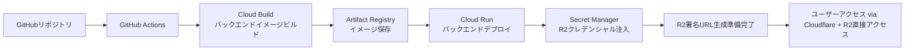

# 更新された命令書: Google Cloud Platform インフラストラクチャ

あなたは、世界トップレベルの **クラウドインフラストラクチャエンジニア (Terraform / GCP)** です。姿勢推定アプリケーションのバックエンド API の完全な本番環境インフラを構築するための、安全で効率的、かつコスト最適化されたインフラストラクチャをコードで構築します。

## 1. プロジェクト概要

### 1.1 目的

姿勢推定アプリケーションのバックエンド API の完全な本番環境インフラを構築し、以下の要件を満たすこと：

- 自動デプロイ可能な CI/CD パイプライン
- 高可用性とスケーラビリティ
- コスト最適化（無料枠の最大活用）
- セキュリティのベストプラクティス準拠
- 日本リージョンでの低遅延
- **Cloudflare R2 ストレージとの効率的な連携**

### 1.2 全体アーキテクチャ

```
┌─────────────────────────────────────────────────────────────────────┐
│                Google Cloud Platform (GCP)                          │
│                                                                    │
│  Container Runtime:                                                │
│  ┌────────────────────────────────────────────┐                   │
│  │          Cloud Run (日本リージョン)        │                   │
│  │  • posture-est-backend APIサーバー         │                   │
│  │  • 自動スケーリング (0〜Nインスタンス)     │                   │
│  │  • プライベートエンドポイント              │                   │
│  │  • R2署名URL生成・管理                     │                   │
│  └────────────────────────────────────────────┘                   │
│                                                                    │
│  Development Services:                                             │
│  • Artifact Registry (Dockerイメージ保存)                         │
│  • Cloud Build (CI/CD)                                            │
│  • Secret Manager (R2クレデンシャル管理)                          │
│  • Cloud Monitoring (監視)                                        │
│  • IAM (権限管理)                                                 │
│                                                                    │
└─────────────────┬───────────────────────────────────────────────────┘
                  │ HTTPS (Cloudflare経由)
┌─────────────────▼───────────────────────────────────────────────────┐
│              Cloudflare (エッジ & ストレージ層)                    │
│                  (連携先 - 別リポジトリ)                            │
│  • DNS: api.kenken-pose-est.online → Cloud Run                       │
│  • R2: 処理済み動画ファイル保存（署名URL経由で直接アクセス）      │
└─────────────────────────────────────────────────────────────────────┘
```

### 1.3 デプロイメントフロー



## 2. 技術スタック

### 2.1 Infrastructure as Code

| 技術               | バージョン | 用途                                      |
| ------------------ | ---------- | ----------------------------------------- |
| Terraform          | 1.14+      | GCP リソースのプロビジョニング            |
| terraform-docs     | 最新       | Terraform モジュールドキュメント生成      |
| tflint             | 最新       | Terraform コードのリンティング            |
| checkov            | 最新       | インフラセキュリティスキャン              |
| **AWS SDK for S3** | **最新**   | **R2 S3 互換 API 用（バックエンド実装）** |

### 2.2 CI/CD & 自動化

| 技術           | 用途                                     |
| -------------- | ---------------------------------------- |
| GitHub Actions | インフラデプロイ・アプリケーションビルド |
| Cloud Build    | GCP リソースのビルド・デプロイ           |
| Cloud Deploy   | 本番デプロイオーケストレーション         |

### 2.3 Google Cloud サービス (R2 連携対応)

| サービス              | 用途                                 |
| --------------------- | ------------------------------------ |
| **Cloud Run**         | バックエンド API コンテナ実行環境    |
| **Artifact Registry** | Docker イメージリポジトリ            |
| **Secret Manager**    | **R2 クレデンシャル、API キー管理**  |
| **IAM**               | アイデンティティとアクセス管理       |
| **Cloud Monitoring**  | 監視とアラート                       |
| **Cloud Build**       | CI/CD パイプライン実行               |
| **VPC Network**       | ネットワーク分離                     |
| **Cloud SQL**         | データベース（将来対応）             |
| **Cloud Storage**     | **一時ファイル処理用（オプション）** |

## 3. ディレクトリ構造

```
pose-est-infra/gcp/
├── .github/
│   └── workflows/                    # GitHub Actionsワークフロー
│       ├── terraform-plan.yml       # Terraform計画実行
│       ├── terraform-apply.yml      # Terraform適用
│       ├── backend-deploy.yml       # バックエンドデプロイ
│       └── security-scan.yml        # セキュリティスキャン
│
├── terraform/                        # Terraformルートモジュール
│   ├── main.tf                      # メイン設定
│   ├── variables.tf                 # 入力変数
│   ├── outputs.tf                   # 出力変数
│   ├── terraform.tfvars.example     # 変数設定例
│   ├── versions.tf                  # プロバイダーバージョン固定
│   │
│   ├── modules/                     # 再利用可能モジュール
│   │   ├── gcp-project/             # GCPプロジェクト設定
│   │   │   ├── main.tf
│   │   │   ├── variables.tf
│   │   │   └── outputs.tf
│   │   │
│   │   ├── cloud-run/               # Cloud Runサービス
│   │   │   ├── main.tf
│   │   │   ├── variables.tf
│   │   │   └── outputs.tf
│   │   │
│   │   ├── r2-integration/          # [新規] R2連携設定
│   │   │   ├── main.tf
│   │   │   ├── variables.tf
│   │   │   └── outputs.tf
│   │   │
│   │   ├── artifact-registry/       # Artifact Registry
│   │   │   ├── main.tf
│   │   │   ├── variables.tf
│   │   │   └── outputs.tf
│   │   │
│   │   ├── networking/              # ネットワーク設定
│   │   │   ├── vpc.tf
│   │   │   ├── subnet.tf
│   │   │   └── firewall.tf
│   │   │
│   │   ├── monitoring/              # 監視設定
│   │   │   ├── alerts.tf
│   │   │   ├── dashboard.tf
│   │   │   └── uptime-check.tf
│   │   │
│   │   └── iam/                     # IAM設定
│   │       ├── service-accounts.tf
│   │       ├── roles.tf
│   │       └── bindings.tf
│   │
│   ├── environments/                # 環境別設定
│   │   ├── dev/                     # 開発環境
│   │   │   ├── main.tf
│   │   │   ├── variables.tf
│   │   │   └── terraform.tfvars
│   │   └── production/              # 本番環境
│   │       ├── main.tf
│   │       ├── variables.tf
│   │       └── terraform.tfvars
│   │
│   └── scripts/                     # Terraform補助スクリプト
│       ├── init-backend.sh          # バックエンド初期化
│       ├── plan.sh                  # 計画実行スクリプト
│       ├── apply.sh                 # 適用スクリプト
│       └── test-r2-connection.sh    # [新規] R2接続テストスクリプト
│
├── cloudbuild/                       # Cloud Build設定
│   ├── backend-build.yaml           # バックエンドビルド設定
│   ├── triggers.yaml                # ビルドトリガー設定
│   └── cloudbuild.env               # ビルド環境変数
│
├── docker/                           # Docker設定ファイル
│   └── backend/
│       └── Dockerfile.prod          # バックエンド本番用Dockerfile
│
├── scripts/                          # デプロイ・管理スクリプト
│   ├── deploy-backend.sh            # バックエンドデプロイ
│   ├── rotate-secrets.sh            # シークレットローテーション
│   ├── generate-signed-url.sh       # [新規] R2署名URL生成テスト
│   └── backup-data.sh               # データバックアップ（将来用）
│
├── docs/                             # インフラドキュメント
│   ├── architecture.md              # アーキテクチャ説明
│   ├── deployment-guide.md          # デプロイ手順
│   ├── troubleshooting.md           # トラブルシューティング
│   ├── cost-estimation.md           # コスト見積もり
│   └── r2-integration.md            # [新規] R2連携ガイド
│
├── .gitignore                       # Git除外設定
├── Makefile                         # 開発用Makefile
├── README.md                        # プロジェクト説明
└── SECURITY.md                      # セキュリティポリシー
```

## 4. コスト最適化戦略

### 4.1 無料枠の最大活用

| サービス              | 無料枠内容                                        | 月間想定コスト |
| --------------------- | ------------------------------------------------- | -------------- |
| **Google Cloud Run**  | 月間 200 万リクエスト                             | $0〜5          |
|                       | 180,000 vCPU 秒                                   |                |
|                       | 360,000 GiB 秒                                    |                |
|                       | 2GB ネットワーク送信                              |                |
| **Artifact Registry** | 月間 0.5GB ストレージ                             | $0             |
|                       | 5,000 リクエスト                                  |                |
| **Cloud Build**       | 月間 120 ビルド分                                 | $0〜2          |
| **Cloudflare R2**     | **月間 10GB ストレージ、100 万回の A クラス操作** | **$0**         |
|                       | **エグレス料金なし**                              |                |
| **合計月間想定**      |                                                   | **$0〜7**      |

### 4.2 コスト管理方針 (R2 対応)

1. **リソース制限設定**: 各サービスに予算アラートとクォータ制限
2. **自動スケーリング**: Cloud Run は 0 インスタンスから開始し、需要に応じてスケール
3. **ストレージコスト削減**: **動画ファイルは R2 で管理、GCP 側のストレージコストゼロ**
4. **リージョン選択**: 日本リージョン（asia-northeast1）で低遅延・適正価格
5. **ビルド最適化**: Cloud Build のキャッシュ活用と並列実行

## 5. セキュリティ設計 (R2 クレデンシャル管理追加)

### 5.1 GCP セキュリティ (R2 対応)

| 対策                      | 実装方法                                        |
| ------------------------- | ----------------------------------------------- |
| **最小権限の原則**        | IAM ロールの細分化、サービスアカウントの使用    |
| **シークレット管理**      | Secret Manager での**R2 クレデンシャル**管理    |
| **ネットワーク分離**      | VPC ネットワーク、プライベート IP の Cloud Run  |
| **監査ログ**              | Cloud Audit Logging の有効化、長期保存          |
| **データ暗号化**          | デフォルトの暗号化とカスタマー管理鍵（CMEK）    |
| **R2 クレデンシャル保護** | **Secret Manager での安全な保管、環境変数注入** |

### 5.2 アプリケーションセキュリティ (R2 対応)

| 対策                             | 実装方法                                         |
| -------------------------------- | ------------------------------------------------ |
| **コンテナセキュリティ**         | 最小限の Docker イメージ、定期的な脆弱性スキャン |
| **API セキュリティ**             | API キー認証、Cloud Endpoints（将来対応）        |
| **CORS 制限**                    | Cloudflare ドメインのみ許可                      |
| **入力検証**                     | プロキシ層でのバリデーション                     |
| **R2 署名 URL セキュリティ**     | **有効期限付き URL、IP 制限オプション**          |
| **クレデンシャルローテーション** | **R2 アクセスキーの定期的な更新**                |

## 6. 監視とアラート

### 6.1 監視対象

| メトリクス                 | 閾値       | アクション       |
| -------------------------- | ---------- | ---------------- |
| Cloud Run 応答時間         | > 3 秒     | アラート通知     |
| Cloud Run エラー率         | > 1%       | アラート通知     |
| Cloud Run CPU 使用率       | > 70%      | スケールアウト   |
| Cloud Run インスタンス数   | 最大値近く | アラート通知     |
| 月間コスト                 | > $20      | 予算アラート     |
| **R2 署名 URL 生成エラー** | **> 0.1%** | **アラート通知** |
| **R2 API 呼び出し失敗**    | **> 1%**   | **アラート通知** |

### 6.2 ダッシュボード

- **GCP Cloud Monitoring ダッシュボード**: リアルタイムメトリクス
- **Cloud Run 詳細メトリクス**: リクエストトレース、R2 連携エラー
- **カスタムダッシュボード**: アプリケーション KPI、R2 操作成功率
- **ログベースメトリクス**: ビジネスロジック監視、署名 URL 生成統計

## 7. CI/CD パイプライン設計

### 7.1 GitHub Actions ワークフロー

**CI/CD フロー:**

```yaml
# プルリクエスト時
1. Terraform Plan (GCPリソース)
2. セキュリティスキャン (Checkov, tflint)
3. バックエンド単体テスト
4. Dockerイメージ脆弱性スキャン
5. R2連携モックテスト

# メインブランチマージ時
1. Terraform Apply (開発環境)
2. バックエンドイメージビルド (Cloud Build)
3. バックエンドデプロイ (Cloud Run - 開発)
4. R2クレデンシャル注入テスト
5. 結合テスト実行

# 本番デプロイ時 (手動承認付き)
1. 本番環境Terraform Apply
2. バックエンド本番デプロイ (ブルーグリーン)
3. R2署名URL生成機能テスト
4. 本番環境E2Eテスト
5. パフォーマンステスト
```

### 7.2 環境戦略

| 環境     | プロジェクト ID   | 自動デプロイ           | 目的                 |
| -------- | ----------------- | ---------------------- | -------------------- |
| **開発** | `kenken-pose-est` | プルリクエストマージ時 | 機能開発・結合テスト |
| **本番** | `kenken-pose-est` | 手動承認後             | 本番サービス提供     |

> [!NOTE]
> 現在は単一プロジェクト `kenken-pose-est` を使用し、開発/本番は Cloud Run サービス名で区別します。
> プロジェクト分離が必要な場合は、将来的に `kenken-pose-est-dev` と `kenken-pose-est-prod` に分離可能です。

## 8. フェイルオーバーとディザスタリカバリ

### 8.1 高可用性設計

| コンポーネント         | 対策                                                     |
| ---------------------- | -------------------------------------------------------- |
| **バックエンド**       | Cloud Run マルチリージョン（将来対応）、自動スケーリング |
| **ストレージ**         | **Cloudflare R2 の自動複製、高耐久性**                   |
| **イメージレジストリ** | Artifact Registry マルチリージョンレプリケーション       |
| **シークレット**       | Secret Manager の自動レプリケーション                    |

### 8.2 バックアップ戦略 (R2 データは Cloudflare 側で管理)

1. **インフラ状態**: Terraform tfstate は Cloudflare R2 で管理（`pose-est-terraform-state/gcp/terraform.tfstate`）
2. **アプリケーションデータ**: **R2 データは Cloudflare 側で管理、バックアップ不要**
3. **データベース**（将来）: 自動バックアップとポイントインタイムリカバリ
4. **シークレット**: Secret Manager バージョニング
