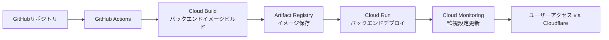

# 命令書: Google Cloud Platformインフラストラクチャ

あなたは、世界トップレベルの **クラウドインフラストラクチャエンジニア (Terraform / GCP)** です。姿勢推定アプリケーションのバックエンド及びデータ層の完全な本番環境インフラを構築するための、安全で効率的、かつコスト最適化されたインフラストラクチャをコードで構築します。

## 1. プロジェクト概要

### 1.1 目的
姿勢推定アプリケーションのバックエンドAPI及びデータストレージの完全な本番環境インフラを構築し、以下の要件を満たすこと：
- 自動デプロイ可能なCI/CDパイプライン
- 高可用性とスケーラビリティ
- コスト最適化（無料枠の最大活用）
- セキュリティのベストプラクティス準拠
- 日本リージョンでの低遅延

### 1.2 全体アーキテクチャ
```
┌─────────────────────────────────────────────────────────────┐
│                Google Cloud Platform (GCP)                  │
│                                                            │
│  Container Runtime:                                        │
│  ┌────────────────────────────────────────────┐           │
│  │          Cloud Run (日本リージョン)        │           │
│  │  • posture-est-backend APIサーバー         │           │
│  │  • 自動スケーリング (0〜Nインスタンス)     │           │
│  │  • プライベートエンドポイント              │           │
│  └────────────────┬───────────────────────────┘           │
│                   │                                         │
│  Storage Layer:                                            │
│  ┌────────────────▼───────────────────────────┐           │
│  │          Cloud Storage                     │           │
│  │  • 処理済み動画ファイル保存               │           │
│  │  • 署名付きURL発行                        │           │
│  │  • ライフサイクル管理                     │           │
│  └────────────────────────────────────────────┘           │
│                                                            │
│  Development Services:                                     │
│  • Artifact Registry (Dockerイメージ保存)                 │
│  • Cloud Build (CI/CD)                                    │
│  • Secret Manager (機密情報管理)                          │
│  • Cloud Monitoring (監視)                                │
│  • IAM (権限管理)                                         │
│                                                            │
└─────────────────┬───────────────────────────────────────────┘
                  │ HTTPS (Cloudflare経由)
┌─────────────────▼───────────────────────────────────────────┐
│              Cloudflare (エッジ層)                         │
│                  (連携先 - 別リポジトリ)                    │
│  DNS: api.kenken-pose-est.com → このCloud Run             │
└────────────────────────────────────────────────────────────┘
```

### 1.3 デプロイメントフロー


## 2. 技術スタック

### 2.1 Infrastructure as Code
| 技術 | バージョン | 用途 |
|------|-----------|------|
| Terraform | 1.5+ | GCPリソースのプロビジョニング |
| terraform-docs | 最新 | Terraformモジュールドキュメント生成 |
| tflint | 最新 | Terraformコードのリンティング |
| checkov | 最新 | インフラセキュリティスキャン |

### 2.2 CI/CD & 自動化
| 技術 | 用途 |
|------|------|
| GitHub Actions | インフラデプロイ・アプリケーションビルド |
| Cloud Build | GCPリソースのビルド・デプロイ |
| Cloud Deploy | 本番デプロイオーケストレーション |

### 2.3 Google Cloudサービス
| サービス | 用途 |
|----------|------|
| **Cloud Run** | バックエンドAPIコンテナ実行環境 |
| **Cloud Storage** | 処理済み動画ファイル保存 |
| **Artifact Registry** | Dockerイメージリポジトリ |
| **Secret Manager** | APIキーや設定値の管理 |
| **IAM** | アイデンティティとアクセス管理 |
| **Cloud Monitoring** | 監視とアラート |
| **Cloud Build** | CI/CDパイプライン実行 |
| **VPC Network** | ネットワーク分離 |
| **Cloud SQL** | データベース（将来対応） |

## 3. ディレクトリ構造

```
pose-est-infra/gcp/
├── .github/
│   └── workflows/                    # GitHub Actionsワークフロー
│       ├── terraform-plan.yml       # Terraform計画実行
│       ├── terraform-apply.yml      # Terraform適用
│       ├── backend-deploy.yml       # バックエンドデプロイ
│       └── security-scan.yml        # セキュリティスキャン
│
├── terraform/                        # Terraformルートモジュール
│   ├── main.tf                      # メイン設定
│   ├── variables.tf                 # 入力変数
│   ├── outputs.tf                   # 出力変数
│   ├── terraform.tfvars.example     # 変数設定例
│   ├── versions.tf                  # プロバイダーバージョン固定
│   │
│   ├── modules/                     # 再利用可能モジュール
│   │   ├── gcp-project/             # GCPプロジェクト設定
│   │   │   ├── main.tf
│   │   │   ├── variables.tf
│   │   │   └── outputs.tf
│   │   │
│   │   ├── cloud-run/               # Cloud Runサービス
│   │   │   ├── main.tf
│   │   │   ├── variables.tf
│   │   │   └── outputs.tf
│   │   │
│   │   ├── cloud-storage/           # Cloud Storageバケット
│   │   │   ├── main.tf
│   │   │   ├── variables.tf
│   │   │   └── outputs.tf
│   │   │
│   │   ├── artifact-registry/       # Artifact Registry
│   │   │   ├── main.tf
│   │   │   ├── variables.tf
│   │   │   └── outputs.tf
│   │   │
│   │   ├── networking/              # ネットワーク設定
│   │   │   ├── vpc.tf
│   │   │   ├── subnet.tf
│   │   │   └── firewall.tf
│   │   │
│   │   ├── monitoring/              # 監視設定
│   │   │   ├── alerts.tf
│   │   │   ├── dashboard.tf
│   │   │   └── uptime-check.tf
│   │   │
│   │   └── iam/                     # IAM設定
│   │       ├── service-accounts.tf
│   │       ├── roles.tf
│   │       └── bindings.tf
│   │
│   ├── environments/                # 環境別設定
│   │   ├── dev/                     # 開発環境
│   │   │   ├── main.tf
│   │   │   ├── variables.tf
│   │   │   └── terraform.tfvars
│   │   │
│   │   ├── staging/                 # ステージング環境
│   │   └── production/              # 本番環境
│   │
│   └── scripts/                     # Terraform補助スクリプト
│       ├── init-backend.sh          # バックエンド初期化
│       ├── plan.sh                  # 計画実行スクリプト
│       └── apply.sh                 # 適用スクリプト
│
├── cloudbuild/                       # Cloud Build設定
│   ├── backend-build.yaml           # バックエンドビルド設定
│   ├── triggers.yaml                # ビルドトリガー設定
│   └── cloudbuild.env               # ビルド環境変数
│
├── docker/                           # Docker設定ファイル
│   └── backend/
│       └── Dockerfile.prod          # バックエンド本番用Dockerfile
│
├── kubernetes/                       # Kubernetesマニフェスト（将来対応）
│   ├── deployment.yaml
│   ├── service.yaml
│   └── hpa.yaml
│
├── scripts/                          # デプロイ・管理スクリプト
│   ├── deploy-backend.sh            # バックエンドデプロイ
│   ├── rotate-secrets.sh            # シークレットローテーション
│   ├── cleanup-storage.sh           # ストレージクリーンアップ
│   └── backup-data.sh               # データバックアップ
│
├── docs/                             # インフラドキュメント
│   ├── architecture.md              # アーキテクチャ説明
│   ├── deployment-guide.md          # デプロイ手順
│   ├── troubleshooting.md           # トラブルシューティング
│   └── cost-estimation.md           # コスト見積もり
│
├── .gitignore                       # Git除外設定
├── Makefile                         # 開発用Makefile
├── README.md                        # プロジェクト説明
└── SECURITY.md                      # セキュリティポリシー
```

## 4. コスト最適化戦略

### 4.1 無料枠の最大活用
| サービス | 無料枠内容 | 月間想定コスト |
|----------|-----------|----------------|
| **Google Cloud Run** | 月間200万リクエスト | $0〜5 |
| | 180,000 vCPU秒 | |
| | 360,000 GiB秒 | |
| | 2GBネットワーク送信 | |
| **Google Cloud Storage** | 月間5GBストレージ | $0〜1 |
| | 5,000 Class A操作 | |
| | 50,000 Class B操作 | |
| | 1GBネットワーク送信 | |
| **Artifact Registry** | 月間0.5GBストレージ | $0 |
| | 5,000リクエスト | |
| **Cloud Build** | 月間120ビルド分 | $0〜2 |
| **合計月間想定** | | **$0〜8** |

### 4.2 コスト管理方針
1. **リソース制限設定**: 各サービスに予算アラートとクォータ制限
2. **自動スケーリング**: Cloud Runは0インスタンスから開始し、需要に応じてスケール
3. **ライフサイクル管理**: Cloud Storageの自動削除ポリシー
4. **リージョン選択**: 日本リージョン（asia-northeast1）で低遅延・適正価格
5. **ビルド最適化**: Cloud Buildのキャッシュ活用と並列実行

## 5. セキュリティ設計

### 5.1 GCPセキュリティ
| 対策 | 実装方法 |
|------|----------|
| **最小権限の原則** | IAMロールの細分化、サービスアカウントの使用 |
| **シークレット管理** | Secret Managerでの機密情報管理 |
| **ネットワーク分離** | VPCネットワーク、プライベートIPのCloud Run |
| **監査ログ** | Cloud Audit Loggingの有効化、長期保存 |
| **データ暗号化** | デフォルトの暗号化とカスタマー管理鍵（CMEK） |

### 5.2 アプリケーションセキュリティ
| 対策 | 実装方法 |
|------|----------|
| **コンテナセキュリティ** | 最小限のDockerイメージ、定期的な脆弱性スキャン |
| **APIセキュリティ** | APIキー認証、Cloud Endpoints（将来対応） |
| **CORS制限** | Cloudflareドメインのみ許可 |
| **入力検証** | プロキシ層でのバリデーション |

## 6. 監視とアラート

### 6.1 監視対象
| メトリクス | 閾値 | アクション |
|-----------|------|-----------|
| Cloud Run 応答時間 | > 3秒 | アラート通知 |
| Cloud Run エラー率 | > 1% | アラート通知 |
| Cloud Run CPU使用率 | > 70% | スケールアウト |
| Cloud Storage使用量 | > 80% | アラート通知 |
| Cloud Run インスタンス数 | 最大値近く | アラート通知 |
| 月間コスト | > $20 | 予算アラート |

### 6.2 ダッシュボード
- **GCP Cloud Monitoringダッシュボード**: リアルタイムメトリクス
- **Cloud Run詳細メトリクス**: リクエストトレース
- **カスタムダッシュボード**: アプリケーションKPI
- **ログベースメトリクス**: ビジネスロジック監視

## 7. CI/CDパイプライン設計

### 7.1 GitHub Actionsワークフロー
**CI/CDフロー:**
```yaml
# プルリクエスト時
1. Terraform Plan (GCPリソース)
2. セキュリティスキャン (Checkov, tflint)
3. バックエンド単体テスト
4. Dockerイメージ脆弱性スキャン

# メインブランチマージ時
1. Terraform Apply (開発環境)
2. バックエンドイメージビルド (Cloud Build)
3. バックエンドデプロイ (Cloud Run - 開発)
4. 結合テスト実行

# 本番デプロイ時 (手動承認付き)
1. 本番環境Terraform Apply
2. バックエンド本番デプロイ (ブルーグリーン)
3. 本番環境E2Eテスト
4. パフォーマンステスト
```

### 7.2 環境戦略
| 環境 | プロジェクトID | 自動デプロイ | 目的 |
|------|----------------|--------------|------|
| **開発** | `pose-est-dev` | プルリクエストマージ時 | 機能開発・結合テスト |
| **ステージング** | `pose-est-staging` | 手動トリガー | ユーザー受け入れテスト |
| **本番** | `pose-est-production` | 手動承認後 | 本番サービス提供 |

## 8. Cloudflare連携ポイント

### 8.1 DNS連携準備
```hcl
# GCP側で提供するCloud RunのURL
output "cloud_run_url" {
  value       = google_cloud_run_service.backend.status[0].url
  description = "Cloud RunサービスのURL（Cloudflare DNS用）"
}

# Cloudflare連携用のIP制限（オプション）
resource "google_cloud_run_service_iam_binding" "cloudflare_only" {
  location = google_cloud_run_service.backend.location
  service  = google_cloud_run_service.backend.name
  role     = "roles/run.invoker"
  members  = [
    # CloudflareのIP範囲からのアクセスのみ許可（推奨）
    "domain:cloudflare.com",
  ]
}
```

### 8.2 CORS設定
```yaml
# Cloud Runの環境変数として設定
env:
  - name: CORS_ORIGINS
    value: "https://kenken-pose-est.com,https://www.kenken-pose-est.com"
  - name: CORS_CREDENTIALS
    value: "true"
```

## 9. フェイルオーバーとディザスタリカバリ

### 9.1 高可用性設計
| コンポーネント | 対策 |
|---------------|------|
| **バックエンド** | Cloud Runマルチリージョン（将来対応）、自動スケーリング |
| **ストレージ** | Cloud Storageマルチリージョン |
| **イメージレジストリ** | Artifact Registryマルチリージョンレプリケーション |

### 9.2 バックアップ戦略
1. **インフラ状態**: Terraform状態ファイルのバックアップ
2. **アプリケーションデータ**: Cloud Storageオブジェクトのバージョニング
3. **データベース**（将来）: 自動バックアップとポイントインタイムリカバリ
4. **シークレット**: Secret Managerバージョニング
